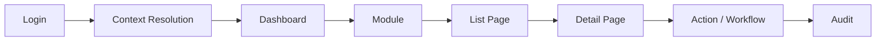
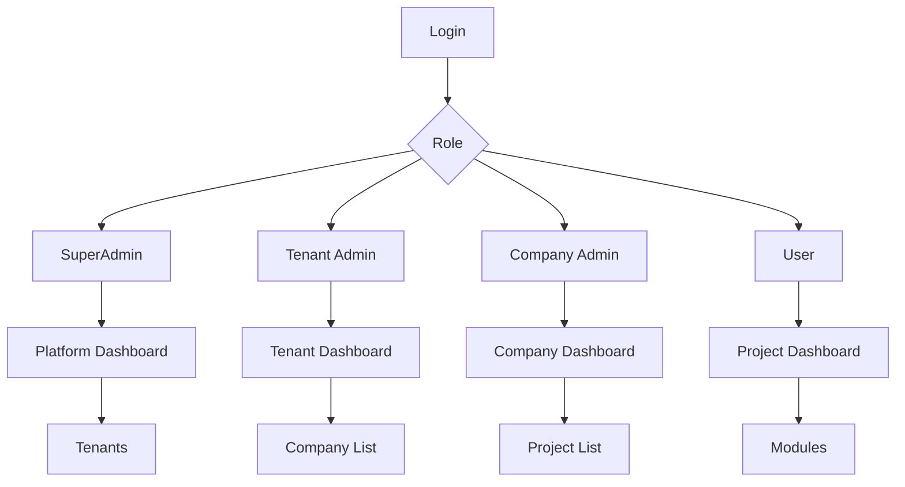
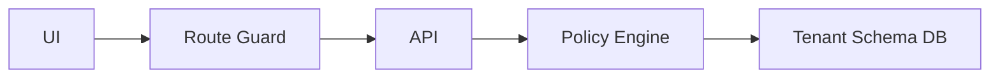

# HOW GLOBAL ERPs ARE BUILT (SAP / Oracle / Zoho / Odoo - Reality)

Before design, understand how world-class ERPs think:

- Normal ERPs focus on screens + CRUD.
- Advanced ERPs focus on PROCESS + CONTROL + AUDIT + SCALE.

Core pillars:

- Business process first
- Role and authority first
- Data isolation and security
- Configuration over hardcode
- Audit everything
- UI is dynamic, not static

## UABINDIA ERP - Advanced Architecture Model

### Core principle (most important)

ERP is not pages.
ERP is a controlled business operating system.

### 1. Platform architecture (global standard)

Platform (SaaS Owner)
- Tenant (Client Org)
  - Company (Legal Entity)
    - Project / Unit / Branch
      - Modules
        - Processes
          - Tasks

This hierarchy never changes.

### 2. Multi-tenancy model (correct approach)

| Layer | Design |
| --- | --- |
| Tenant | Separate schema per tenant |
| Company | Table-level isolation |
| Project | Row-level isolation |
| Modules | License-controlled |
| Users | Role + scope controlled |

### 3. Role system (advanced - not basic RBAC)

#### Global ERP roles (4-layer)

1. Super Admin (Platform)
   - Full system
   - All tenants
   - No business work
2. Tenant Admin (Client Owner)
   - Own tenant only
   - Companies + users + modules
3. Business Admin (Company / Project Head)
   - Operations control
   - Approvals
   - Reports
4. Operational Users
   - Task execution only
   - No configuration power

#### Advanced role control (difference from others)

- Normal ERP: Role = permission list
- UAB ERP: Role = Permission + Scope + Action + Condition

Permission formula:

Can USER do ACTION
ON RESOURCE
IN SCOPE
UNDER CONDITION

Example:

Employee can APPLY_LEAVE
only for SELF
only in ACTIVE_PROJECT
only if BALANCE_AVAILABLE = true

### 4. UI control system (advanced ERP feature)

UI is not static.

UI depends on:

- Role
- Module license
- Tenant config
- Company rules
- Project rules

#### UI control layers

| Layer | Controlled By |
| --- | --- |
| Menu | Role + License |
| Routes | Backend permission |
| Buttons | Policy engine |
| Fields | Role + condition |
| Actions | Workflow state |

### 5. Frontend page blueprint (full ERP)

#### Platform (SuperAdmin)

/platform
- tenants
- plans
- modules
- audits
- system-health

#### Tenant

/tenant
- dashboard
- companies
- users
- modules
- policies

#### Company

/company/:id
- dashboard
- projects
- users
- settings

#### Project (real work)

/project/:id
- dashboard
- hrms
- accounts
- inventory
- compliance

### 6. Module design (all business types)

#### HRMS

- Employee lifecycle
- Attendance
- Leave
- Payroll
- Performance

#### Finance and Accounts

- Expenses
- Invoices
- Ledger
- GST / TDS

#### Inventory

- Items
- Stock
- Vendors
- Purchase

#### Projects

- Task management
- Billing
- Resource allocation

#### Compliance

- Documents
- Audits
- Statuary reports

#### MIS and Analytics

- KPI dashboards
- Forecasting
- Export

### 7. Process-driven ERP (key difference)

- Normal ERP: Button -> Save
- UAB ERP: Workflow engine

Example: Leave process

Apply -> Manager approval -> HR approval -> Payroll impact -> Audit log

Every step:

- Role-checked
- Logged
- Reversible (where allowed)

### 8. Configuration over code (advanced)

Everything configurable:

- Leave rules
- Approval levels
- Salary calculation
- Attendance policy
- Working days

Stored in:

- TenantConfig
- CompanyPolicy
- ProjectRules

### 9. Audit and traceability (enterprise level)

Every action logs:

- Who
- What
- When
- From where
- Before / after value

This is mandatory for large companies.

### 10. Backend implementation flow (real world)

Phase-wise build (safe):

- Phase 0 - Foundation
  - Auth
  - Tenant schema
  - Role engine
- Phase 1 - Core control
  - Company
  - Project
  - Users
  - Permissions
- Phase 2 - Licensing and UI guard
  - Module enable/disable
  - UI hide/show
- Phase 3 - HRMS
  - Employee lifecycle
  - Attendance
  - Payroll
- Phase 4 - Accounts and inventory
  - Finance
  - Procurement
- Phase 5 - Analytics and automation
  - Reports
  - Alerts
  - AI insights

### 11. What makes UAB ERP different and interesting

Advanced features:

- Schema-per-tenant isolation
- Workflow engine
- Dynamic UI
- Rule-based permissions
- Multi-company and multi-project
- Audit-ready
- Government and enterprise fit

What others miss:

- Hardcoded roles
- Static UI
- No real audit
- No scope-based access
- Poor scalability

### 12. Implementation checklist (for you)

- Tenant provisioning
- Role engine
- Policy engine
- UI guards
- Workflow system
- Audit logging
- Module licensing

### Final advice (as global ERP architect)

Do not rush modules.
Lock control, roles, and process first.
Modules will automatically be powerful.

## ERP Pages Flow - Page ke andar kya hota hai aur kaise follow hota hai

ERP me page sirf screen nahi hota, balki page = process ka ek step.

### Visual flow diagrams (Mermaid)

ERP page flow (core):

Role-based navigation control:

Permission enforcement layer:

### Global page follow rule (golden rule)

Login
 -> Context Select (Tenant / Company / Project)
   -> Dashboard
     -> Module
       -> List Page
         -> Detail Page
           -> Action / Workflow

Har ERP page isi logic ko follow karta hai.

### Step 1: Login and context resolution

Login page me:

- Email / Mobile
- Password / OTP
- Remember device

Backend se milta hai:

- Role
- Tenant
- Company access
- Project access

Login ke baad direct dashboard nahi jata, pehle context set hota hai.

Context auto-setting:

| Role | Context |
| --- | --- |
| SuperAdmin | Platform |
| Tenant Admin | Tenant |
| Company Admin | Company |
| User | Project |

### Step 2: Dashboard pages (entry point)

Dashboard ka kaam: user ko ye samjhana ki wo abhi kaha khada hai.

Platform dashboard (SuperAdmin):

- Total tenants
- Active / inactive tenants
- Revenue snapshot
- System health
- Alerts

Flow: Dashboard -> Tenants -> Tenant Detail

Tenant dashboard (Tenant Admin):

- Total companies
- Active projects
- Users count
- Enabled modules
- License usage

CTA buttons:

- Create company
- Add user
- Enable module

Flow: Tenant Dashboard -> Company List -> Company Dashboard

Company dashboard (Company Admin):

- Company info
- Projects summary
- Employees count
- Pending approvals

Flow: Company Dashboard -> Project List -> Project Dashboard

Project dashboard (user working area):

- My tasks
- Attendance status
- Payroll status
- Module shortcuts

Flow: Project Dashboard -> HRMS / Accounts / Inventory

### Step 3: Module pages structure (most important)

Har module same structure follow karta hai.

Module page structure (standard):

Module Root
- List Page
  - Filters
  - Table
  - Actions
- Create / Edit Page
  - Form
  - Validation
  - Save
- Detail Page
  - Summary
  - History
  - Actions
- Workflow / Approval

#### HRMS module - page breakdown

Employee List Page:

- Search
- Filters (Dept, Status)
- Table
- Add Employee (if allowed)

Employee Detail Page (tabs):

- Profile
- Attendance
- Leave
- Payroll
- Documents
- Audit log

Actions:

- Edit (role based)
- Disable
- Transfer project

Attendance pages:

- Attendance list
- Daily view
- Monthly summary
- Exceptions
- Approval page

Leave pages:

- Apply leave
- My leaves
- Team leaves (Manager)
- Leave approval
- Policy view (read-only)

Payroll pages:

- Salary structure
- Payroll run
- Payslip view
- Deduction breakdown

### Step 4: Page control (role + rule based)

Page sirf tab dikhega jab:

- User ka role allow karta ho
- Module licensed ho
- User ka scope match ho
- Workflow state allow kare

Page visibility logic (example):

If role = Employee
 AND module = HRMS
 AND projectAssigned = true
 -> Show Attendance
Else -> Hide

Frontend UI control (kaha kya dikhega):

- Sidebar: role + module based, dynamic menu
- Buttons: role based, workflow based
- Fields: editable / readonly, role and status based

### Step 5: Page navigation flow (user POV)

Example: Employee leave apply

Login
 -> Project Dashboard
 -> HRMS
 -> Leave
 -> Apply Leave
 -> Submit
 -> Status Page

Example: Manager approval

Login
 -> Project Dashboard
 -> Approvals
 -> Leave Approval
 -> Approve / Reject

### Page follow karne ke rules (very important)

- Direct page jump allow nahi
- URL hack se access nahi
- Context mandatory
- Backend permission final
- Audit har page action pe

### Frontend folder structure (implementable)

/pages
- platform
- tenant
- company
- project
  - dashboard
  - hrms
    - employees
    - attendance
    - leave
  - accounts
  - inventory

### Simple words me summary

- ERP pages process follow karte hain
- Har page ka role + scope hota hai
- Dashboard sirf entry point hai
- Module pages same structure follow karte hain
- Backend decide karta hai kya dikhega

## Analysis and implications

- Flow consistency: Login -> Context -> Dashboard -> Module -> List -> Detail -> Action flow ensures every page is a controlled process step, not a standalone screen.
- Access enforcement: Context resolution plus backend permission checks stop URL jumps and enforce audit-friendly navigation.
- UI predictability: Standard module page structure makes training, support, and scaling easier across business functions.
- Control surface: Role, scope, license, and workflow state become the actual UI contract, enabling dynamic menus and conditional actions.
- Implementation impact: Frontend routes should mirror the hierarchy, and backend policies should be the single source of truth for visibility and actions.
